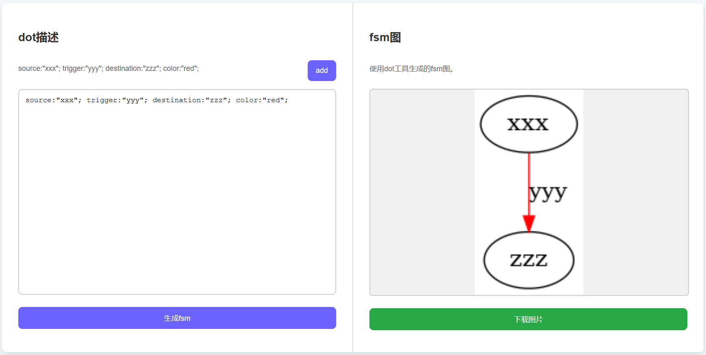

# module_fsm

状态转移图绘制工具。

使用graphviz的dot工具进行状态转移图的绘制。

dot语法总结: https://onlookerliu.github.io/2017/12/28/dot语法总结/#1-简介

> 最终布局方式使用了circo -> 圆环布局。

## preview



## usage

url: http://47.117.65.167:9090/module_fsm

状态转移图中每条边的描述如下所示：

```shell
source:"xxx"; trigger:"yyy"; destination:"zzz"; color:"red";
```

- source: 开始状态
- trigger: 转移条件
- destination: 结束状态
- color: 边的颜色，可选。

注意点:

1. 目前不支持中文，状态名称和转移条件均不支持中文。
2. 每行只可以有一条边的描述。

